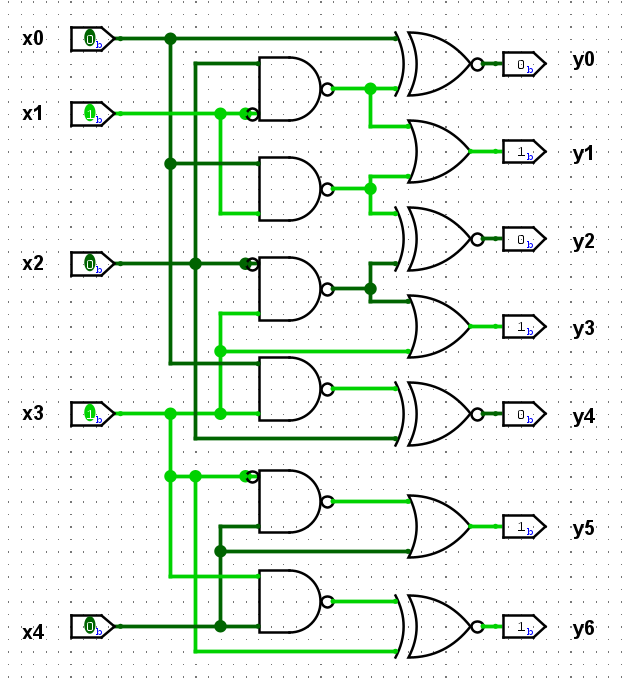

# Hardware 1 - ORbit

# ORbit
You are given a logic circuit (see orbit.png) and asked to give the binary output corresponding to the input such that (x0, x1, x2, x3, x4) = (0, 1, 0, 1, 0).  
Surround your answer with ectf{ } to obtain the flag.

As an example, entering (x0, x1, x2, x3, x4) = (1, 0, 0, 0, 0) gives (y0, y1, y2, y3, y4, y5, y6), so the flag would be ectf{1111010}.

### File:
Hardware_1_-_ORbit.png

\Author - Loïc

#### Points :
`100`

## Solution

`ectf{0101011}`

#### Step 1: Inputting into the Circuit

The challenge specified the input order for the binary string into the logic circuit.

#### Step 2: Interacting with the Logic Circuit

With the binary input correctly aligned, the next step was to interact with the logic circuit. This involved analyzing the circuit diagram provided and adjusting the input bits accordingly.

- **Logic Gates**: The circuit contained a series of logic gates, and the goal was to achieve the correct output by manipulating the inputs based on the gate operations.
- We used a simulation tool to visualize the circuit, noting that:
  - Dark green represented a binary `0`.
  - Light green represented a binary `1`.  

