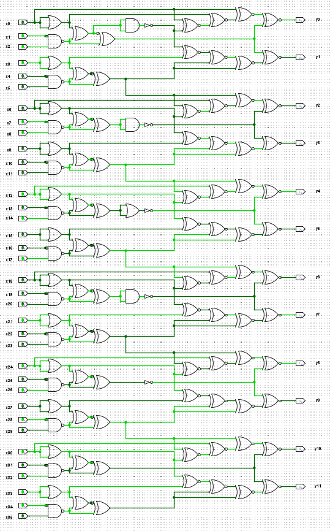

# Hardware 2 - It's trivial !

# It's trivial !
You are given a logic circuit (see it_is_trivial.png) and asked to give the binary output corresponding to the input x = 30478191278.  
Surround your answer with ectf{ } to obtain the flag.

As an example, entering x = 34359738368 gives (y0, ..., y11), so the flag would be ectf{010000000011}.

### File:
Hardware_2_-_it_is_trivial.png

\Author - Loïc

#### Points :
`300`

## Solution

`ectf{100010011000}`

#### Step 1: Decimal to Binary Conversion

The first task was to convert the decimal number into binary. The given number, `30478191278`, converts to binary as follows:

- **Binary Representation**: `011100011000101001000100101010101110`

#### Step 2: Handling Leading Zeros

Upon examining the challenge, it was crucial to understand that the most significant bit (MSB) might not have been directly involved in the conversion to decimal. Therefore, we had to ensure that the binary representation was correctly aligned.

- We added a leading zero to the binary string after conversion to match the circuit's requirements:
  - Modified Binary: `011100011000101001000100101010101110`

#### Step 3: Inputting into the Circuit

The challenge specified the input order for the binary string into the logic circuit:

- **Mapping**: The binary string had to be entered such that `x0` was the MSB and `x35` was the LSB.

#### Step 4: Interacting with the Logic Circuit

With the binary input correctly aligned, the next step was to interact with the logic circuit. This involved analyzing the circuit diagram provided and adjusting the input bits accordingly.

- **Logic Gates**: The circuit contained a series of logic gates, and the goal was to achieve the correct output by manipulating the inputs based on the gate operations.
- We used a simulation tool to visualize the circuit, noting that:
  - Dark green represented a binary `0`.
  - Light green represented a binary `1`.  

