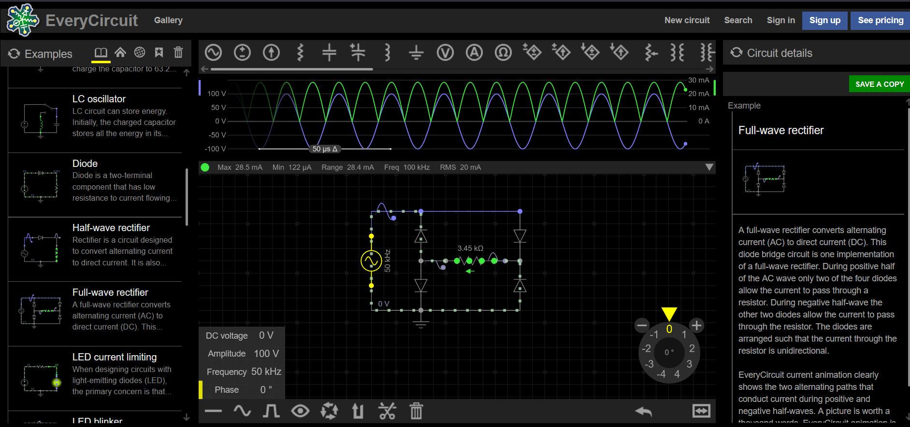

# Hardware 3 - Elec

Use the `full-wave rectifier` schematic on https://everycircuit.com/app.

We know that:
- The AC amplitude is 100V
- The half period is 10µs
- The maximum current across the resistor is 28.5mA

Find the following parameters:
- A = Frequency of the AC in Hz (10kHz = 10000Hz)
- B = Practical value of the resistor in Ohms (10kOhm = 10000Ohm)

We are not looking for the theoretical value of B, but rather the practical value.

Flag format: ectf{AHz_BOhm}

\Author - Loïc

#### Points :
`250`

## Solution

`ectf{50000Hz_3450Ohm}`  

#### Step 1: Accessing the Circuit

The first step was to access the provided website and locate the correct circuit simulation:

- **Website Navigation**: Followed the link provided in the challenge description.
- **Circuit Selection**: Located and selected the "Full-wave Rectifier" circuit for simulation.

#### Step 2: Configuring the AC Source

Once the correct circuit was selected, we needed to configure the AC source with specific parameters:

- **Voltage (V)**: Set the AC source voltage to 100V.
- **Frequency (Hz)**: Adjusted the frequency to 50000Hz. This value was determined by calculating the half period, as indicated in the challenge description: "The half period is 10µs". The frequency is the inverse of twice the half period (`1 / (2 * 10µs) = 50000Hz`).
- **Phase (°)**: Ensured the phase was set to 0° to align with the challenge requirements.

#### Step 3: Adjusting the Resistor

With the AC source properly configured, the next task was to find the correct resistance that yields the desired current across it:

- **Target Current**: 28.5 mA
- **Resistance Adjustment**: Adjusted the resistance value through simulation until the current measured 28.5 mA. It was important to note that the challenge required finding the practical value rather than the theoretical one: "We are not looking for the theoretical value of B, but rather the practical value."
  - **Calculated Resistance**: Determined the correct resistance to be 3450 Ohms via simulation.  

