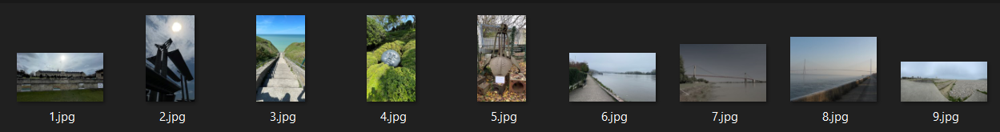

# OSINT 2 - PNJ - 1 - Bridge

Intro : You'll find a zip file Pierre-Nicolas Jaxetfleur's travel photos. 

# Bridge
I have a friend who's a bridge fan, so I take a lot of photos of his buildings on vacation to send him. On the last trip I took a photo of a not-so-famous bridge, but I think it looks great in the morning mist.  
Find the city where I took the photo.  
Flag format: ectf{town-name}

### File:
OSINT_2_-_Travel.zip

\Author - Loïc

#### Points :
`150`

## Solution

`ectf{caudebec-en-caux}`

#### Step 1: Locate the bridges
You need to find the correct bridge among the 4 photographed.  
Therefore, you must know the location of each one.  
There aren't many on the Seine after Rouen, so it's quite easy to determine which one it is.  

  
  

#### Step 2: Match it with the photo of the least known bridge
By identifying certain elements (roofs, hill, boat, etc.), one can determine the exact location.  

  

#### Step 3: Find the name of the town
"Rives-en-Seine" is the name of the commune that encompasses several villages, including "Caudebec-en-Caux," which is the village where the photo was taken.  

 