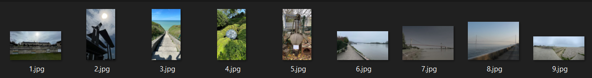
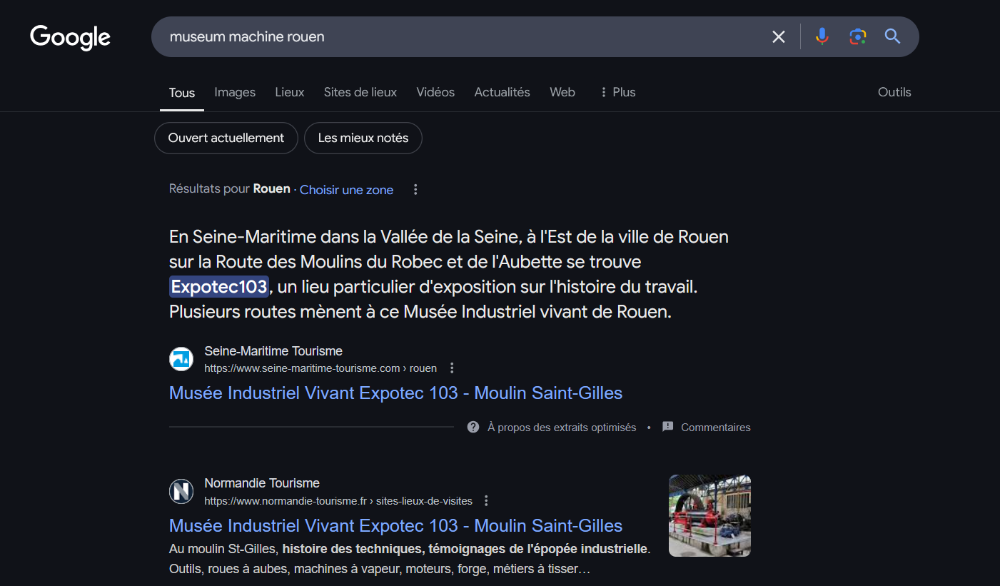

# OSINT 2 - PNJ - 2 - Grapple

# Grapple
I visited a museum that reminded me of my childhood, but with bigger machines.  
Find the location of the Grapple.  
Flag format: ectf{name.name.name}  
https://what3words.com

\Author - Loïc

#### Points :
`200`

## Solution

`ectf{dindon.guimauve.nappons}`  
or  
`ectf{easels.frost.emblem}`  

#### Step 1: Find the city
The task was to locate a museum with large machines.  
With the hint linking photos 2 and 5, one needed to search in Rouen, as this is where the Pont Gustave-Flaubert (2.png) is located.  

 

#### Step 2: Find the museum
Using this information and a simple Google search, one could identify the museum.  

 

Alternatively, you could look up the museums in Rouen and examine them one by one.  

 

