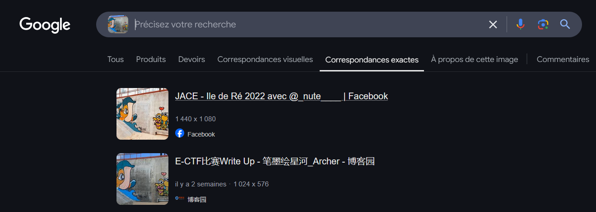

# OSINT 2 - PNJ - 3 - Gouzou

# Gouzou
The photo reminds me of another place I visited a few years ago.  
Find the location of the photo.  
Flag format: ectf{place_name}

\Author - Loïc

#### Points :
`300`

## Solution

`ectf{digue_du_boutillon}`  
or  
`ectf{boutillon_dyke}`

#### Step 1: Find the island
Using the image of the junk or the artwork, one can identify the island in France, which is Île de Ré.  
Site used: https://www.duplichecker.com/fr/reverse-image-search.php

  
  

#### Step 2: Find the location of the artwork
You need to find the exact location.  
A Google dorks search can be conducted: gouzou "ile de ré".  

  

This leads to the author's post, Jace, on Facebook, and more importantly, an article on the website "Ré à la Hune" (The free news journal of Île de Ré).  
In this publication, the name of the dyke is revealed.  

 
